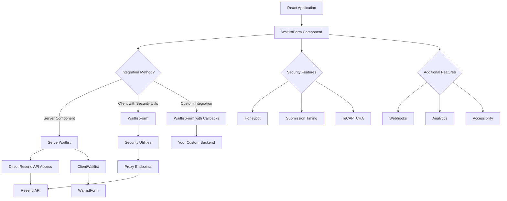

# React Waitlist

A customizable, self-contained waitlist component for React that integrates with Resend audiences. This package provides everything you need to create beautiful, secure waitlist forms without external dependencies.

## Features

- Secure integration with [Resend audiences](https://resend.com/blog/manage-subscribers-using-resend-audiences)
- Fully customizable UI with theming support
- Bot and spam protection with reCAPTCHA v3
- Accessibility built-in
- Analytics tracking
- Easy to integrate with any React application
- Event system for client-side integrations
- Webhook support for integration with external systems
- Multiple security options built into the package
- SSR Support for Next.js and other frameworks

## Installation

### Frontend (React application)

```bash
npm install react-waitlist
# or
yarn add react-waitlist
# or
pnpm add react-waitlist
```

### Backend (Optional but recommended for security)

```bash
npm install react-waitlist/server
# or
yarn add react-waitlist/server
```

## Integration Options

React Waitlist is designed to be flexible and secure, offering multiple integration options depending on your application architecture:

### 1. Server-Side Integration (Most Secure)

For frameworks with server-side rendering support (Next.js App Router, Remix, etc.), use the `ServerWaitlist` and `ClientWaitlist` components to keep API keys secure on the server:

```jsx
// app/page.js (Next.js App Router)
import { ServerWaitlist, ClientWaitlist } from 'react-waitlist/server';

export default function Home() {
  return (
    <main>
      <h1>My Awesome Product</h1>
      {/* Server Component - Renders a placeholder */}
      <ServerWaitlist 
        apiKey={process.env.RESEND_API_KEY} // Securely used on the server
        resendAudienceId="your_audience_id"
        title="Join Our Waitlist"
      />
      {/* Client Component - Hydrates the placeholder */}
      <ClientWaitlist />
    </main>
  );
}
```

### 2. Client-Side with Security Utilities (Recommended for most applications)

For client-side React applications, use the included security utilities to create proxy endpoints that protect your API keys:

```jsx
// Frontend component
import { WaitlistForm } from 'react-waitlist';

function App() {
  return (
    <WaitlistForm 
      resendAudienceId="your_audience_id"
      resendProxyEndpoint="/api/resend-proxy"
    />
  );
}

// Backend proxy (part of this package)
// api/resend-proxy.js
import { createResendProxy } from 'react-waitlist/server';

export default createResendProxy({
  apiKey: process.env.RESEND_API_KEY,
  allowedAudiences: ['your_audience_id'],
});
```

### 3. Custom Integration with Your Own Backend

Use event callbacks to integrate with your existing backend systems:

```jsx
import { WaitlistForm } from 'react-waitlist';

function App() {
  return (
    <WaitlistForm 
      onSuccess={({ formData }) => {
        // Handle successful submission with your own backend
        fetch('https://your-api.com/waitlist', {
          method: 'POST',
          headers: { 'Content-Type': 'application/json' },
          body: JSON.stringify(formData)
        });
      }}
    />
  );
}
```

## Basic Usage

### Frontend (React)

React Waitlist can be integrated with various systems through different methods:

#### Simple Usage with Custom Handlers

```jsx
import { WaitlistForm } from 'react-waitlist';

function App() {
  return (
    <WaitlistForm 
      onSuccess={({ formData }) => {
        // Handle successful submission
        console.log('Form submitted successfully:', formData);
        // You could save to your database here
        saveToDatabase(formData);
        // Or integrate with your CRM
        sendToCRM(formData);
        // Or add to your marketing tool
        addToMailingList(formData);
      }}
      onError={({ error }) => {
        console.error('Error submitting form:', error);
      }}
    />
  );
}
```

#### With Resend Integration

```jsx
import { WaitlistForm } from 'react-waitlist';

function App() {
  return (
    <WaitlistForm 
      resendAudienceId="your_audience_id"
      resendProxyEndpoint="https://your-api.com/api/resend-proxy"
    />
  );
}
```

#### With Webhooks for External Systems

```jsx
import { WaitlistForm } from 'react-waitlist';

function App() {
  return (
    <WaitlistForm 
      webhooks={[
        {
          url: "https://your-api.com/webhook",
          events: ["success"],
          includeAllFields: true
        }
      ]}
      webhookProxyEndpoint="https://your-api.com/api/webhook-proxy"
    />
  );
}
```

#### Combining Multiple Integration Methods

```jsx
import { WaitlistForm } from 'react-waitlist';

function App() {
  return (
    <WaitlistForm 
      // Resend integration
      resendAudienceId="your_audience_id"
      resendProxyEndpoint="https://your-api.com/api/resend-proxy"
      
      // Event callbacks
      onSuccess={({ formData, response }) => {
        // Custom logic after successful submission
        trackConversion(formData);
      }}
      
      // Webhooks for external systems
      webhooks={[
        {
          url: "https://your-crm.com/api/leads",
          events: ["success"]
        }
      ]}
      webhookProxyEndpoint="https://your-api.com/api/webhook-proxy"
    />
  );
}
```

## Server-Side Rendering (SSR) Architecture

When using the `ServerWaitlist` and `ClientWaitlist` components with frameworks like Next.js App Router, the following architecture is used:

1. **ServerWaitlist (Server Component)**: 
   - Runs on the server only
   - Securely handles API keys and sensitive configuration
   - Renders a placeholder with serialized props
   - No React hooks or client-side code

2. **ClientWaitlist (Client Component)**:
   - Has the `'use client'` directive
   - Hydrates the placeholder rendered by ServerWaitlist
   - Handles all client-side interactivity
   - Uses React hooks for state management

This architecture ensures that sensitive information like API keys stays on the server while providing a seamless user experience with client-side interactivity.

## Backend Setup (Optional but Recommended)

For security reasons, it's recommended to use proxy endpoints to protect your API keys and credentials.

### Express.js Backend

```javascript
// server.js
const express = require('express');
const cors = require('cors');
const { createResendProxy } = require('react-waitlist/server');

const app = express();
app.use(express.json());
app.use(cors());

app.post('/api/resend-proxy', createResendProxy({
  apiKey: process.env.RESEND_API_KEY,
  allowedAudiences: ['your_audience_id'],
}));

app.listen(3001, () => {
  console.log('Server running on port 3001');
});
```

### AWS Lambda Function

```javascript
// lambda-function.js
const { createResendProxy } = require('react-waitlist/server');

const proxyHandler = createResendProxy({
  apiKey: process.env.RESEND_API_KEY,
  allowedAudiences: ['your_audience_id'],
});

exports.handler = async (event) => {
  const req = {
    body: JSON.parse(event.body),
    headers: event.headers,
  };
  
  let statusCode = 200;
  let responseBody = {};
  
  const res = {
    status: (code) => {
      statusCode = code;
      return {
        json: (data) => {
          responseBody = data;
        }
      };
    }
  };
  
  await proxyHandler(req, res);
  
  return {
    statusCode,
    body: JSON.stringify(responseBody),
    headers: {
      'Content-Type': 'application/json'
    }
  };
};
```

### Firebase Cloud Function

```javascript
// functions/index.js
const functions = require('firebase-functions');
const { createResendProxy } = require('react-waitlist/server');

exports.resendProxy = functions.https.onRequest(async (req, res) => {
  const proxyHandler = createResendProxy({
    apiKey: process.env.RESEND_API_KEY,
    allowedAudiences: ['your_audience_id'],
  });
  
  await proxyHandler(req, res);
});
```

## Next.js Integration

For Next.js applications, you can use the same component with API routes:

```jsx
// pages/api/resend-proxy.js (Next.js Pages Router)
import { createResendProxy } from 'react-waitlist/server';

export default createResendProxy({
  apiKey: process.env.RESEND_API_KEY,
  allowedAudiences: ['your_audience_id'],
});
```

```jsx
// app/api/resend-proxy/route.js (Next.js App Router)
import { NextResponse } from 'next/server';
import { createResendProxy } from 'react-waitlist/server';

const proxyHandler = createResendProxy({
  apiKey: process.env.RESEND_API_KEY,
  allowedAudiences: ['your_audience_id'],
});

export async function POST(req) {
  const res = {
    status: (code) => ({
      json: (data) => NextResponse.json(data, { status: code }),
    }),
  };
  return await proxyHandler(req, res);
}
```

## Customization

The component is designed to be highly customizable to match your application's design system.

```jsx
import { WaitlistForm } from 'react-waitlist';

function App() {
  return (
    <WaitlistForm 
      // Theme customization
      theme={{
        colors: {
          primary: '#6366F1',
          secondary: '#8B5CF6',
          background: '#FFFFFF',
          text: '#1F2937',
          error: '#EF4444',
          success: '#10B981',
        }
      }}
      
      // Apply custom CSS class
      className="my-custom-waitlist"
      
      // Content customization
      title="Join our waitlist"
      description="Be the first to know when we launch"
      submitText="Join Now"
      successTitle="You're on the list!"
      successDescription="Thank you for joining our waitlist."
      
      // Field customization
      fields={[
        { name: 'email', type: 'email', required: true, label: 'Email' },
        { name: 'firstName', type: 'text', required: false, label: 'First Name' },
        { name: 'role', type: 'select', options: ['Developer', 'Designer', 'Other'], required: false }
      ]}
    />
  );
}
```

The component supports multiple customization approaches:

- **Theme Configuration**: Customize colors, typography, spacing, and more via the `theme` prop
- **CSS Classes**: Apply custom styles with the `className` prop
- **External CSS**: Use CSS variables and advanced styling techniques
- **Design System Integration**: Seamlessly integrate with your existing design system

For detailed customization options and examples, see the [Customization Guide](docs/customization.md).

## Architecture

React Waitlist is designed as a complete solution with both client and server components working together to provide security and flexibility.



The security utilities (`createResendProxy`, `createWebhookProxy`, `createRecaptchaProxy`) are included as part of this package, not external dependencies. They help you create secure endpoints that protect your API keys and credentials while maintaining a seamless developer experience.

## Documentation

For full documentation and examples, visit our [Storybook documentation](https://pmatheusvinhas.github.io/react-waitlist/).

Additional documentation:
- [Getting Started](https://github.com/pmatheusvinhas/react-waitlist/blob/main/docs/getting-started.md)
- [API Reference](https://github.com/pmatheusvinhas/react-waitlist/blob/main/docs/api-reference.md)
- [Customization](https://github.com/pmatheusvinhas/react-waitlist/blob/main/docs/customization.md)
- [Webhooks](https://github.com/pmatheusvinhas/react-waitlist/blob/main/docs/webhooks.md)
- [Events](https://github.com/pmatheusvinhas/react-waitlist/blob/main/docs/events.md)
- [reCAPTCHA](https://github.com/pmatheusvinhas/react-waitlist/blob/main/docs/recaptcha.md)
- [Accessibility](https://github.com/pmatheusvinhas/react-waitlist/blob/main/docs/accessibility.md)
- [Security](https://github.com/pmatheusvinhas/react-waitlist/blob/main/docs/security.md)
- [Testing](https://github.com/pmatheusvinhas/react-waitlist/blob/main/docs/testing.md)
- [Changelog](https://github.com/pmatheusvinhas/react-waitlist/blob/main/CHANGELOG.md)

## License

MIT 