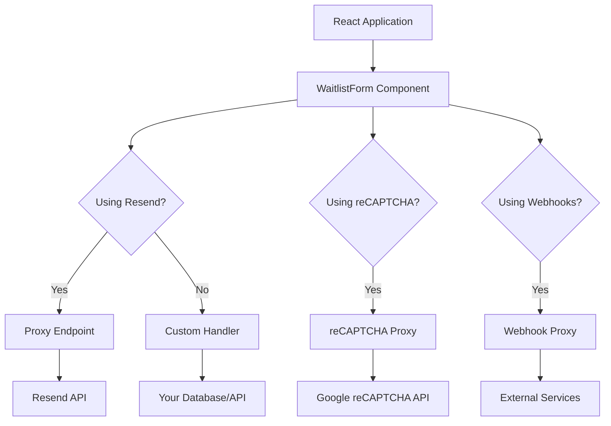

# React Waitlist

A customizable waitlist component for React that integrates with Resend audiences.

## Features

- 🔒 Secure integration with [Resend audiences](https://resend.com/blog/manage-subscribers-using-resend-audiences)
- 🎨 Fully customizable UI with theming support
- 🤖 Bot and spam protection with reCAPTCHA v3
- ♿ Accessibility built-in
- 📊 Analytics tracking
- 🔌 Easy to integrate with any React application
- 🔔 Event system for client-side integrations
- 🪝 Webhook support for integration with external systems

## Installation

### Frontend (React application)

```bash
npm install react-waitlist
# or
yarn add react-waitlist
```

### Backend (Optional but recommended for security)

```bash
npm install react-waitlist/server
# or
yarn add react-waitlist/server
```

## Basic Usage

### Frontend (React)

React Waitlist can be integrated with various systems through different methods:

#### Simple Usage with Custom Handlers

```jsx
import { WaitlistForm } from 'react-waitlist';

function App() {
  return (
    <WaitlistForm 
      onSuccess={({ formData }) => {
        // Handle successful submission
        console.log('Form submitted successfully:', formData);
        // You could save to your database here
        saveToDatabase(formData);
        // Or integrate with your CRM
        sendToCRM(formData);
        // Or add to your marketing tool
        addToMailingList(formData);
      }}
      onError={({ error }) => {
        console.error('Error submitting form:', error);
      }}
    />
  );
}
```

#### With Resend Integration

```jsx
import { WaitlistForm } from 'react-waitlist';

function App() {
  return (
    <WaitlistForm 
      resendAudienceId="your_audience_id"
      resendProxyEndpoint="https://your-api.com/api/resend-proxy"
    />
  );
}
```

#### With Webhooks for External Systems

```jsx
import { WaitlistForm } from 'react-waitlist';

function App() {
  return (
    <WaitlistForm 
      webhooks={[
        {
          url: "https://your-api.com/webhook",
          events: ["success"],
          includeAllFields: true
        }
      ]}
      webhookProxyEndpoint="https://your-api.com/api/webhook-proxy"
    />
  );
}
```

#### Combining Multiple Integration Methods

```jsx
import { WaitlistForm } from 'react-waitlist';

function App() {
  return (
    <WaitlistForm 
      // Resend integration
      resendAudienceId="your_audience_id"
      resendProxyEndpoint="https://your-api.com/api/resend-proxy"
      
      // Event callbacks
      onSuccess={({ formData, response }) => {
        // Custom logic after successful submission
        trackConversion(formData);
      }}
      
      // Webhooks for external systems
      webhooks={[
        {
          url: "https://your-crm.com/api/leads",
          events: ["success"]
        }
      ]}
      webhookProxyEndpoint="https://your-api.com/api/webhook-proxy"
    />
  );
}
```

## Backend Setup (Optional but Recommended)

For security reasons, it's recommended to use proxy endpoints to protect your API keys and credentials.

### Express.js Backend

```javascript
// server.js
const express = require('express');
const cors = require('cors');
const { createResendProxy } = require('react-waitlist/server');

const app = express();
app.use(express.json());
app.use(cors());

app.post('/api/resend-proxy', createResendProxy({
  apiKey: process.env.RESEND_API_KEY,
  allowedAudiences: ['your_audience_id'],
}));

app.listen(3001, () => {
  console.log('Server running on port 3001');
});
```

### AWS Lambda Function

```javascript
// lambda-function.js
const { createResendProxy } = require('react-waitlist/server');

const proxyHandler = createResendProxy({
  apiKey: process.env.RESEND_API_KEY,
  allowedAudiences: ['your_audience_id'],
});

exports.handler = async (event) => {
  const req = {
    body: JSON.parse(event.body),
    headers: event.headers,
  };
  
  let statusCode = 200;
  let responseBody = {};
  
  const res = {
    status: (code) => {
      statusCode = code;
      return {
        json: (data) => {
          responseBody = data;
        }
      };
    }
  };
  
  await proxyHandler(req, res);
  
  return {
    statusCode,
    body: JSON.stringify(responseBody),
    headers: {
      'Content-Type': 'application/json'
    }
  };
};
```

### Firebase Cloud Function

```javascript
// functions/index.js
const functions = require('firebase-functions');
const { createResendProxy } = require('react-waitlist/server');

exports.resendProxy = functions.https.onRequest(async (req, res) => {
  const proxyHandler = createResendProxy({
    apiKey: process.env.RESEND_API_KEY,
    allowedAudiences: ['your_audience_id'],
  });
  
  await proxyHandler(req, res);
});
```

## Next.js Integration

For Next.js applications, you can use the same component with API routes:

```jsx
// pages/api/resend-proxy.js (Next.js Pages Router)
import { createResendProxy } from 'react-waitlist/server';

export default createResendProxy({
  apiKey: process.env.RESEND_API_KEY,
  allowedAudiences: ['your_audience_id'],
});
```

```jsx
// app/api/resend-proxy/route.js (Next.js App Router)
import { NextResponse } from 'next/server';
import { createResendProxy } from 'react-waitlist/server';

const proxyHandler = createResendProxy({
  apiKey: process.env.RESEND_API_KEY,
  allowedAudiences: ['your_audience_id'],
});

export async function POST(req) {
  const res = {
    status: (code) => ({
      json: (data) => NextResponse.json(data, { status: code }),
    }),
  };
  return await proxyHandler(req, res);
}
```

## Customization

```jsx
<WaitlistForm 
  // Event handlers
  onView={({ timestamp }) => console.log('Form viewed at', timestamp)}
  onSubmit={({ formData }) => console.log('Form submitted with', formData)}
  onSuccess={({ response }) => console.log('Success:', response)}
  onError={({ error }) => console.error('Error:', error)}
  
  // Content
  title="Join our waitlist"
  description="Be the first to know when we launch"
  submitText="Join waitlist"
  successTitle="You're on the list!"
  successDescription="Thank you for joining our waitlist. We'll keep you updated."
  
  // Custom fields
  fields={[
    { name: 'email', type: 'email', required: true, label: 'Email' },
    { name: 'firstName', type: 'text', required: false, label: 'First Name' },
    { name: 'company', type: 'text', required: false, label: 'Company' },
    { 
      name: 'role', 
      type: 'select', 
      options: ['Developer', 'Designer', 'Product Manager', 'Other'],
      label: 'Role',
      metadata: true
    }
  ]}
  
  // Theme
  theme={{
    colors: {
      primary: '#3182CE',
      secondary: '#805AD5',
      // ...
    },
    // ...
  }}
  
  // Security with reCAPTCHA (requires proxy endpoint)
  security={{
    enableReCaptcha: true,
    reCaptchaSiteKey: "your_recaptcha_site_key",
    reCaptchaMinScore: 0.5,
    enableHoneypot: true,
    checkSubmissionTime: true
  }}
  recaptchaProxyEndpoint="https://your-api.com/api/recaptcha-proxy"
  
  // Webhooks (requires proxy endpoint for security)
  webhooks={[
    {
      url: "https://your-webhook-endpoint.com/hook",
      events: ["success"],
      includeAllFields: true
    }
  ]}
  webhookProxyEndpoint="https://your-api.com/api/webhook-proxy"
/>
```

## Architecture



## Documentation

For full documentation and examples, visit our [Storybook documentation](https://pmatheusvinhas.github.io/react-waitlist/).

Additional documentation:
- [Getting Started](https://github.com/pmatheusvinhas/react-waitlist/blob/main/docs/getting-started.md)
- [API Reference](https://github.com/pmatheusvinhas/react-waitlist/blob/main/docs/api-reference.md)
- [Customization](https://github.com/pmatheusvinhas/react-waitlist/blob/main/docs/customization.md)
- [Webhooks](https://github.com/pmatheusvinhas/react-waitlist/blob/main/docs/webhooks.md)
- [Events](https://github.com/pmatheusvinhas/react-waitlist/blob/main/docs/events.md)
- [reCAPTCHA](https://github.com/pmatheusvinhas/react-waitlist/blob/main/docs/recaptcha.md)
- [Accessibility](https://github.com/pmatheusvinhas/react-waitlist/blob/main/docs/accessibility.md)
- [Security](https://github.com/pmatheusvinhas/react-waitlist/blob/main/docs/security.md)
- [Testing](https://github.com/pmatheusvinhas/react-waitlist/blob/main/docs/testing.md)
- [Changelog](https://github.com/pmatheusvinhas/react-waitlist/blob/main/CHANGELOG.md)

## License

MIT 