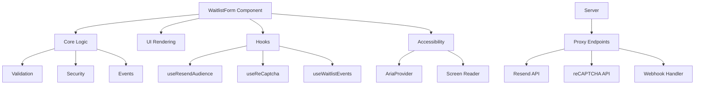

# React Waitlist

A customizable waitlist component for React applications with Resend integration.

## Overview

React Waitlist is a standalone component that allows you to easily add a waitlist signup form to your React application. It integrates seamlessly with [Resend](https://resend.com) to collect and manage your waitlist subscribers.

The component is designed to be:
- **Easy to use**: Simple API with sensible defaults
- **Customizable**: Extensive theming options
- **Secure**: Built-in protections against spam and bots
- **Accessible**: WCAG compliant with screen reader support
- **Framework-agnostic**: Works with any React framework

## Table of Contents

- [React Waitlist](#react-waitlist)
  - [Overview](#overview)
  - [Table of Contents](#table-of-contents)
  - [Installation](#installation)
  - [Quick Start](#quick-start)
    - [Client-side Usage with Proxy](#client-side-usage-with-proxy)
    - [Setting Up Proxy Endpoints](#setting-up-proxy-endpoints)
      - [Next.js Example](#nextjs-example)
  - [Features](#features)
  - [Examples](#examples)
    - [Vite with Proxy Example](#vite-with-proxy-example)
    - [Vite Direct Example](#vite-direct-example)
  - [Architecture](#architecture)
  - [Security](#security)
    - [Honeypot Fields](#honeypot-fields)
    - [Submission Time Checks](#submission-time-checks)
    - [Google reCAPTCHA v3](#google-recaptcha-v3)
    - [Rate Limiting](#rate-limiting)
  - [Documentation](#documentation)
  - [License](#license)

## Installation

```bash
npm install react-waitlist
# or
yarn add react-waitlist
# or
pnpm add react-waitlist
```

## Quick Start

### Client-side Usage with Proxy

For client-side usage, it's recommended to use a proxy endpoint to protect your API keys:

```jsx
import { WaitlistForm } from 'react-waitlist';

function App() {
  return (
    <WaitlistForm
      title="Join Our Waitlist"
      description="Be the first to know when we launch."
      submitText="Join Now"
      
      // Resend integration
      resendAudienceId="YOUR_AUDIENCE_ID"
      resendProxyEndpoint="/api/resend-proxy"
      
      // Security features
      security={{
        enableHoneypot: true,
        checkSubmissionTime: true,
        enableReCaptcha: true,
        reCaptchaSiteKey: "YOUR_RECAPTCHA_SITE_KEY",
        recaptchaProxyEndpoint: "/api/recaptcha-proxy"
      }}
      
      // Event handlers
      onSuccess={(data) => console.log('Success:', data)}
      onError={(data) => console.error('Error:', data)}
    />
  );
}
```

### Setting Up Proxy Endpoints

Create proxy API routes to securely handle API requests:

#### Next.js Example

```js
// pages/api/resend-proxy.js
import { createResendProxy } from 'react-waitlist/server';

const handler = createResendProxy({
  apiKey: process.env.RESEND_API_KEY,
  allowedAudiences: [process.env.RESEND_AUDIENCE_ID],
  // Optional rate limiting
  rateLimit: {
    max: 5,  // 5 requests
    windowSec: 60  // per minute
  }
});

export default async function resendProxyHandler(req, res) {
  try {
    await handler(req, res);
  } catch (error) {
    console.error('Resend proxy error:', error);
    res.status(500).json({ 
      error: error.message || 'Internal server error' 
    });
  }
}
```

```js
// pages/api/recaptcha-proxy.js
import { createRecaptchaProxy } from 'react-waitlist/server';

const handler = createRecaptchaProxy({
  secretKey: process.env.RECAPTCHA_SECRET_KEY,
  minScore: 0.5,
  allowedActions: ['submit_waitlist']
});

export default async function recaptchaProxyHandler(req, res) {
  try {
    await handler(req, res);
  } catch (error) {
    console.error('reCAPTCHA proxy error:', error);
    res.status(500).json({ 
      error: error.message || 'Internal server error' 
    });
  }
}
```

## Features

- **Resend Integration**: Easily add subscribers to your Resend audience
- **Customizable Form Fields**: Define the data you want to collect
- **Theming**: Extensive theming options with framework compatibility
- **Security Features**:
  - Honeypot fields to catch bots
  - Submission time checks
  - Google reCAPTCHA v3 integration
  - Rate limiting on proxy endpoints
- **Accessibility**: ARIA attributes, keyboard navigation, screen reader announcements
- **Event Handlers**: React to form events (focus, submit, success, error)
- **Framework Compatibility**: Adapters for popular CSS frameworks

## Examples

Explore our example implementations to see React Waitlist in action:

### Vite with Proxy Example

The [Vite Proxy Example](./examples/vite-proxy) demonstrates the recommended approach for production applications, using proxy endpoints to securely handle API requests without exposing your API keys.

Key features:
- Backend Express server with proxy endpoints
- Proper environment variable separation
- CORS protection and error handling
- Complete implementation of all security features

[View Vite Proxy Example →](./examples/vite-proxy)

### Vite Direct Example

The [Vite Direct Example](./examples/vite-direct) demonstrates direct API usage, which is simpler but less secure and only recommended for development or testing.

Key features:
- Direct integration with Resend API
- No backend server required
- Complete event logging system
- All form fields and customization options

[View Vite Direct Example →](./examples/vite-direct)

## Architecture

React Waitlist is built with a modular architecture that separates concerns:



For more details, see the [Architecture Documentation](./architecture.md).

## Security

React Waitlist includes multiple security measures to protect against spam and bots:

### Honeypot Fields

Invisible fields that bots tend to fill out but real users cannot see:

```jsx
<WaitlistForm
  security={{
    enableHoneypot: true
  }}
/>
```

### Submission Time Checks

Detects submissions that happen too quickly to be from real users:

```jsx
<WaitlistForm
  security={{
    checkSubmissionTime: true,
    minSubmissionTime: 2000 // 2 seconds
  }}
/>
```

### Google reCAPTCHA v3

Invisible CAPTCHA that scores user behavior:

```jsx
<WaitlistForm
  security={{
    enableReCaptcha: true,
    reCaptchaSiteKey: "YOUR_RECAPTCHA_SITE_KEY",
    recaptchaProxyEndpoint: "/api/recaptcha-proxy"
  }}
/>
```

### Rate Limiting

Built-in rate limiting on proxy endpoints prevents abuse:

```js
createResendProxy({
  apiKey: process.env.RESEND_API_KEY,
  rateLimit: {
    max: 5,  // 5 requests
    windowSec: 60  // per minute
  }
})
```

For more details, see the [Security Documentation](./security.md).

## Documentation

Comprehensive documentation is available to help you get the most out of React Waitlist:

- [API Reference](./api.md): Complete API documentation
- [Architecture](./architecture.md): Details about the component's architecture
- [Security](./security.md): Security features and best practices

## License

This project is licensed under the MIT License. See the [LICENSE](./LICENSE) file for more information.