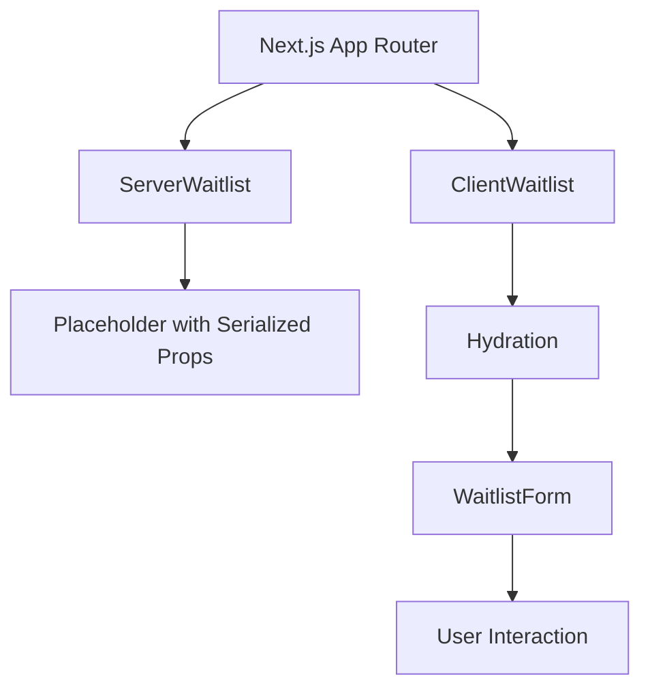
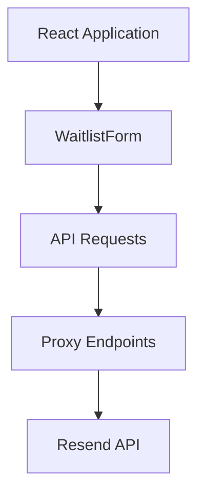
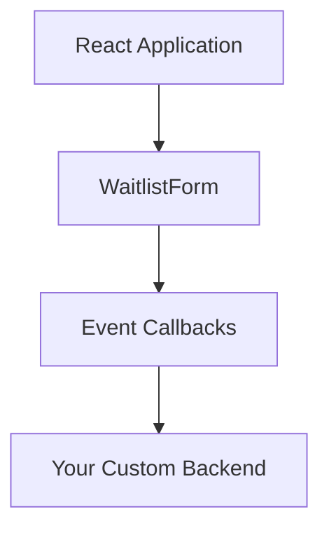
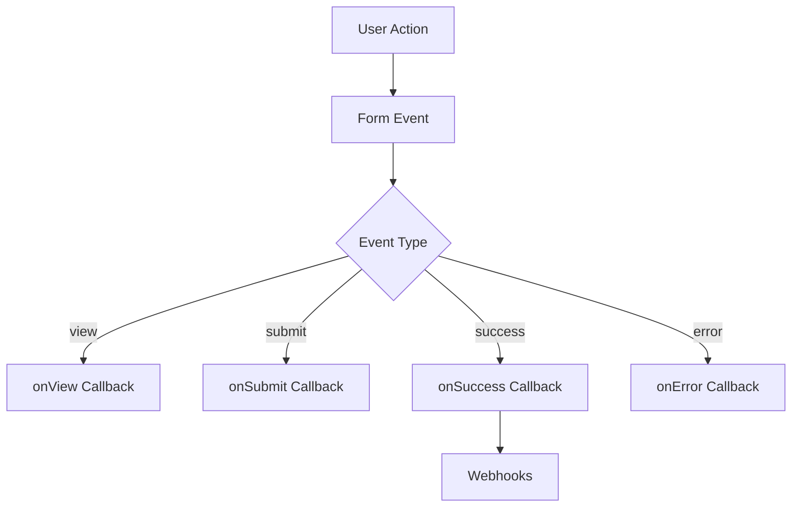

# Architecture

React Waitlist is designed as a complete solution with both client and server components working together to provide security and flexibility.

## Component Architecture

The library is structured around a core `WaitlistForm` component with several integration options:

### 1. Server-Side Rendering (SSR) Architecture

For frameworks with server-side rendering support (Next.js App Router, Remix, etc.), React Waitlist provides a true server-side rendering solution:



This architecture consists of two main components:

1. **ServerWaitlist (Server Component)**: 
   - Runs exclusively on the server
   - Securely handles API keys and sensitive configuration
   - Renders a placeholder with serialized props
   - No React hooks or client-side code
   - Imported from `react-waitlist/server`

2. **ClientWaitlist (Client Component)**:
   - Has the `'use client'` directive
   - Hydrates the placeholder rendered by ServerWaitlist
   - Handles all client-side interactivity
   - Uses React hooks for state management
   - Imported from `react-waitlist/client`

This approach ensures that sensitive information like API keys stays on the server while providing a seamless user experience with client-side interactivity.

#### Import Structure for SSR

```jsx
// In server components:
import { ServerWaitlist } from 'react-waitlist/server';

// In client components:
import { ClientWaitlist } from 'react-waitlist/client';
```

This separation is crucial for frameworks like Next.js that enforce strict boundaries between server and client code.

### 2. Client-Side with Security Utilities

For client-side React applications, React Waitlist provides security utilities to create proxy endpoints:



### 3. Custom Integration

For applications with existing backend systems, React Waitlist provides event callbacks:



## Package Structure

React Waitlist is organized into several modules:

```
react-waitlist/
├── components/       # React components
│   ├── WaitlistForm.tsx
│   ├── ClientWaitlist.tsx
│   └── ...
├── server/           # Server-side components and utilities
│   ├── serverComponent.tsx
│   ├── proxy.ts
│   ├── webhookProxy.ts
│   └── recaptchaProxy.ts
├── hooks/            # React hooks
│   ├── useResendAudience.ts
│   ├── useReCaptcha.ts
│   └── ...
├── utils/            # Utility functions
│   ├── validation.ts
│   ├── security.ts
│   └── ...
├── types/            # TypeScript type definitions
├── styles/           # Styling utilities
└── a11y/             # Accessibility utilities
```

## Export Structure

The package provides multiple entry points:

1. **react-waitlist**: The main package with the `WaitlistForm` component
   ```jsx
   import { WaitlistForm } from 'react-waitlist';
   ```

2. **react-waitlist/server**: Server-side components and utilities
   ```jsx
   import { ServerWaitlist, createResendProxy } from 'react-waitlist/server';
   ```

3. **react-waitlist/client**: Client-side components for hydration
   ```jsx
   import { ClientWaitlist } from 'react-waitlist/client';
   ```

## Data Flow

### Server-Side Rendering Flow

1. The `ServerWaitlist` component receives props on the server
2. It serializes these props and renders a placeholder with a hidden JSON script tag
3. The `ClientWaitlist` component is rendered on the client
4. It finds the placeholder, extracts the serialized props, and hydrates the form
5. The user interacts with the fully functional form

### Client-Side Flow

1. The `WaitlistForm` component is rendered directly
2. It manages its own state and handles form submission
3. API requests are sent to proxy endpoints or handled by custom callbacks

## Security Architecture

React Waitlist implements multiple layers of security:

1. **API Key Protection**: Server-side components and proxy endpoints keep API keys secure
2. **Bot Protection**: Honeypot fields, submission timing checks, and reCAPTCHA integration
3. **Data Validation**: Both client and server-side validation of form data
4. **CORS Protection**: Proxy endpoints implement CORS protection
5. **Rate Limiting**: Optional rate limiting on proxy endpoints

## Event System

The event system allows for integration with analytics and external systems:



## Accessibility Architecture

Accessibility is built into the component architecture:

1. **ARIA Attributes**: Proper ARIA roles, states, and properties
2. **Keyboard Navigation**: Full keyboard support
3. **Screen Reader Support**: Announcements for form state changes
4. **Reduced Motion Support**: Respects user preferences for reduced motion
5. **Focus Management**: Proper focus handling for form submission and errors 