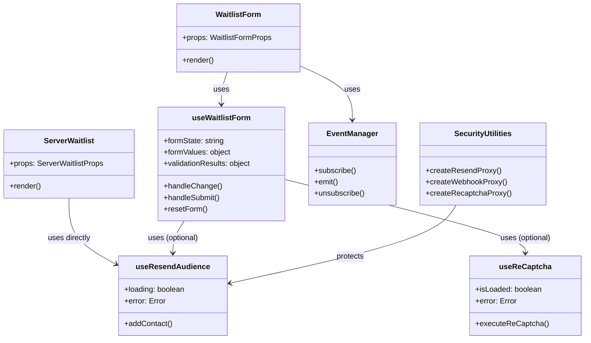
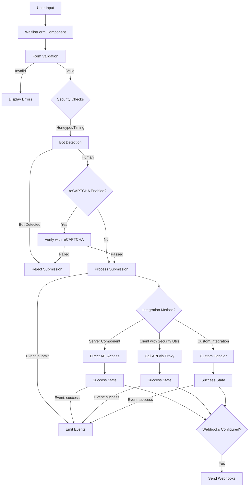
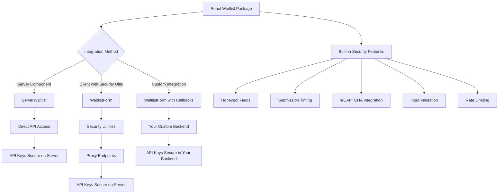
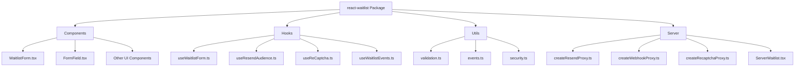
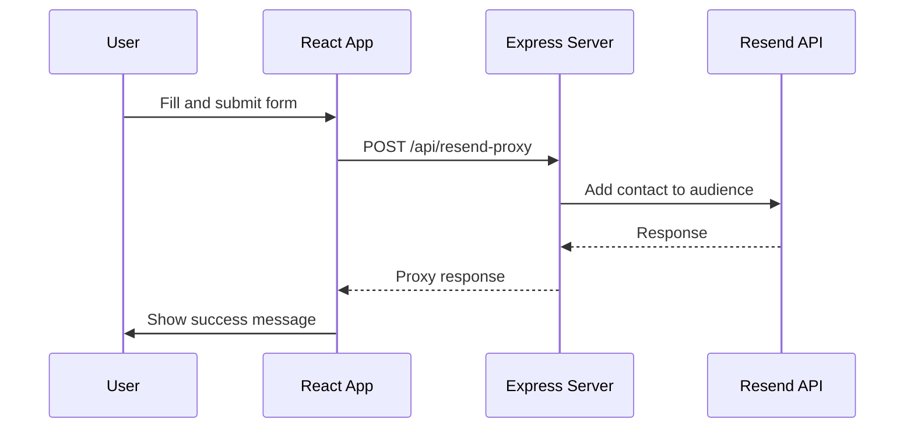
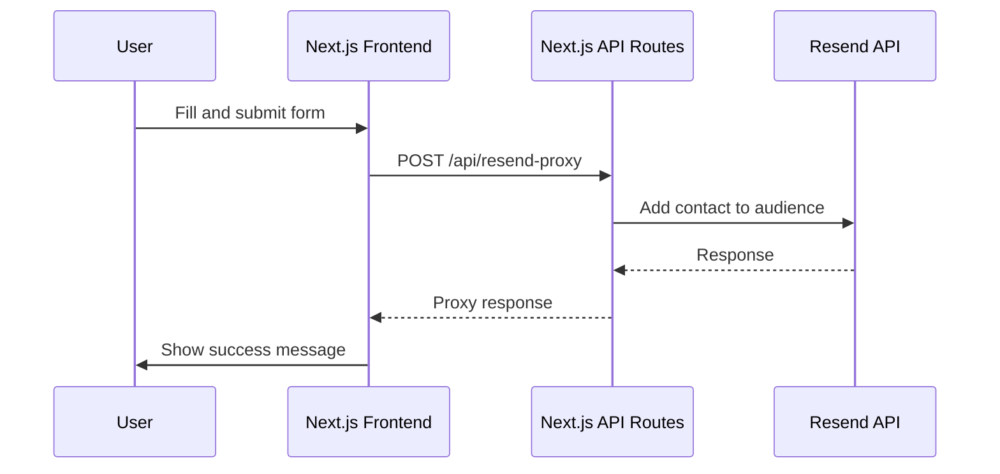
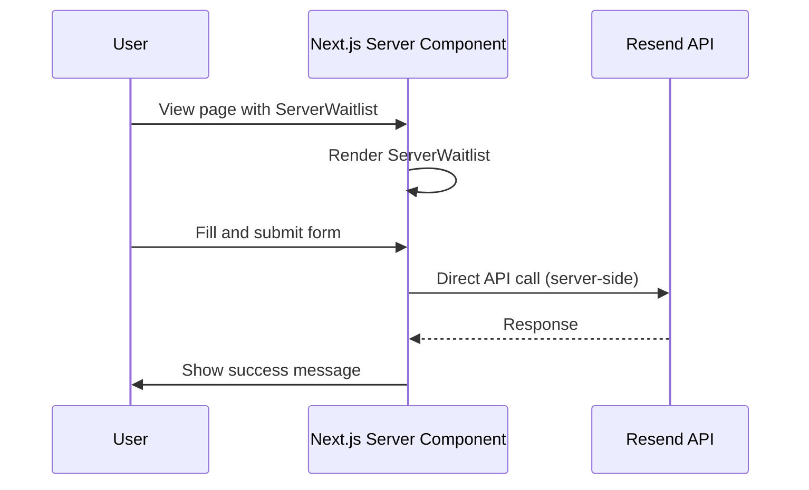

# Architecture

This document provides an overview of the React Waitlist architecture, explaining how the different components interact and the data flows through the system.

## Design Philosophy

React Waitlist is designed as a **complete, self-contained solution** for creating waitlist forms. The architecture follows these key principles:

1. **Security First**: API keys and sensitive credentials should never be exposed in client-side code.

2. **Flexibility**: Support multiple integration patterns to accommodate different application architectures.

3. **Self-Contained**: All necessary components, utilities, and security features are included in the package.

4. **Developer Experience**: Provide a seamless experience for developers while maintaining security best practices.

The package includes both client-side components and server-side utilities that work together as a cohesive system. The server-side utilities are not external dependencies but an integral part of the package, designed to help you create secure endpoints that protect your API keys.

## Integration Options

React Waitlist offers three main integration patterns:

1. **Server Component**: For frameworks with server-side rendering support, the `ServerWaitlist` component handles everything on the server, keeping API keys secure.

2. **Client Component with Security Utilities**: For client-side React applications, the `WaitlistForm` component works with the included security utilities to create proxy endpoints that protect your API keys.

3. **Custom Integration**: Use event callbacks to integrate with your existing backend systems, giving you complete control over the data flow.

## Component Architecture

## Data Flow

## Security Architecture

## Package Structure

## Implementation Examples

### React (CRA/Vite) with Express Backend

### Next.js Full-Stack Implementation

### Next.js Server Component Implementation

## Conclusion

React Waitlist is designed as a complete solution that prioritizes both security and developer experience. By providing multiple integration options and including all necessary security utilities within the package, it offers a self-contained system for creating secure and customizable waitlist forms. 