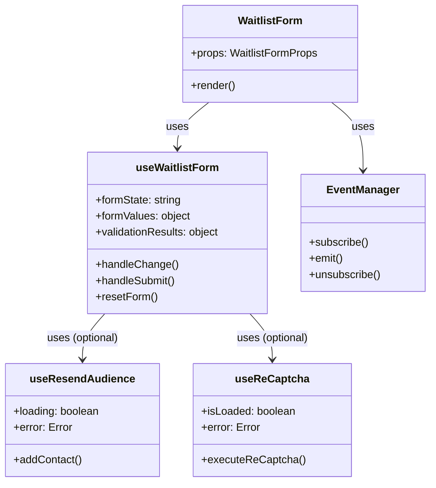
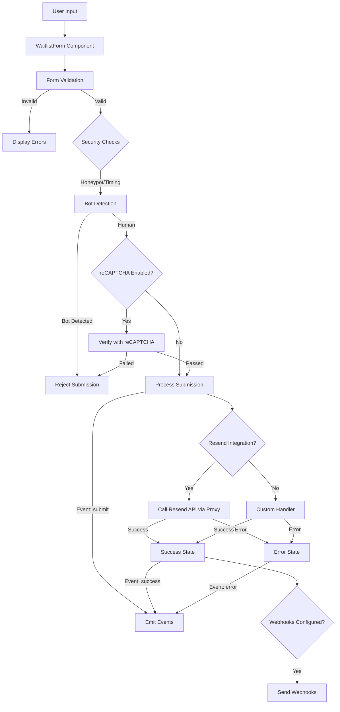
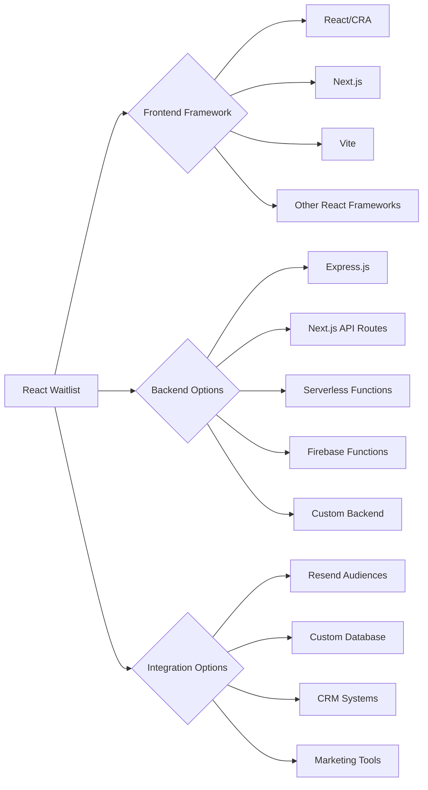
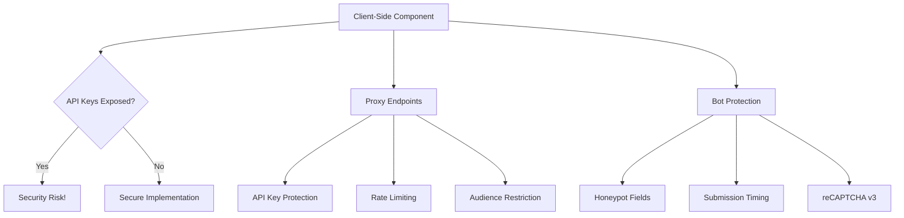
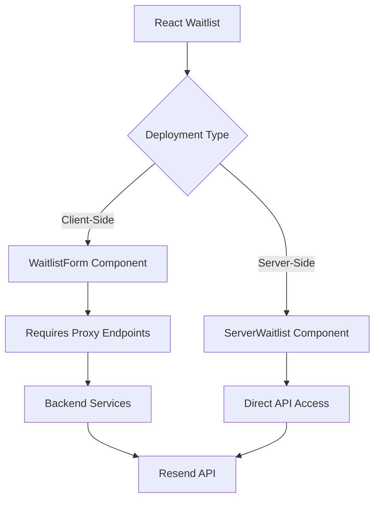
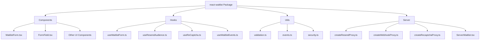
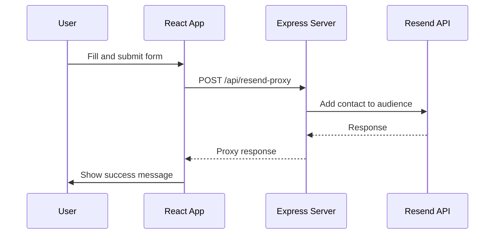
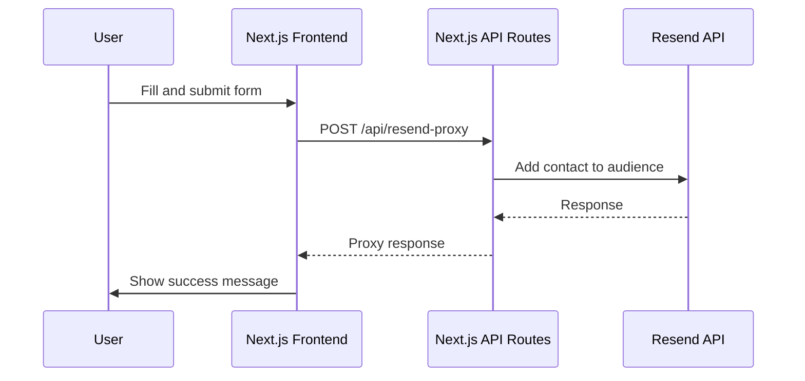
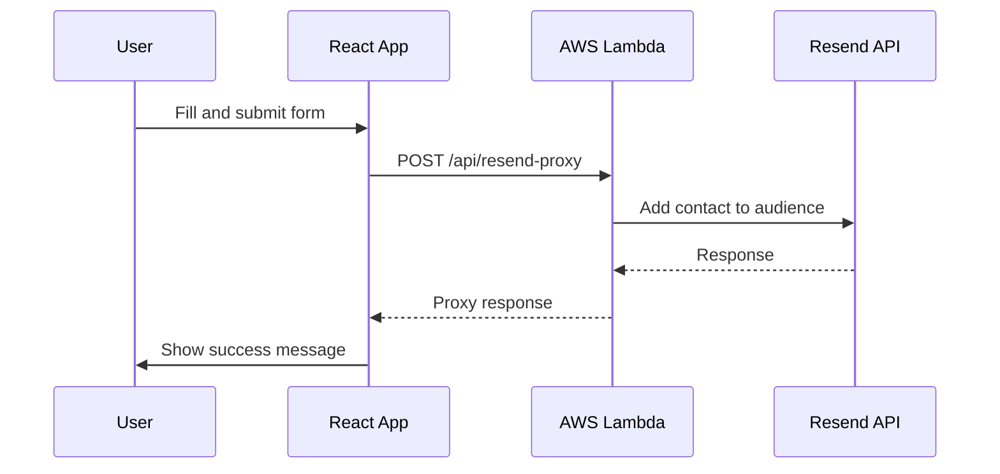

# Architecture

This document provides an overview of the React Waitlist architecture, explaining how the different components interact and the data flows through the system.

## Component Architecture

## Data Flow

## Integration Options

## Security Architecture

## Client-Side vs Server-Side Usage

## Package Structure

## Implementation Examples

### React (CRA/Vite) with Express Backend

### Next.js Full-Stack Implementation

### Serverless Implementation

