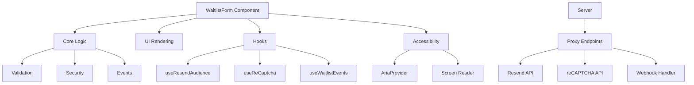
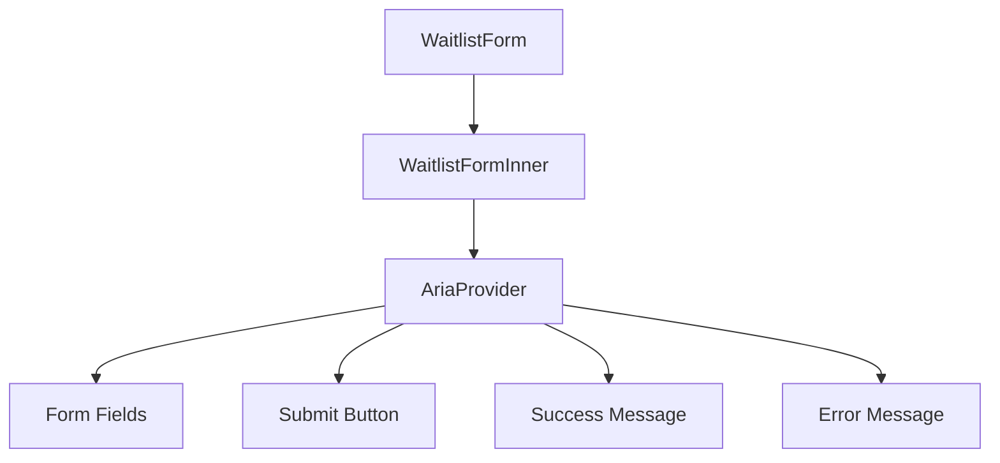
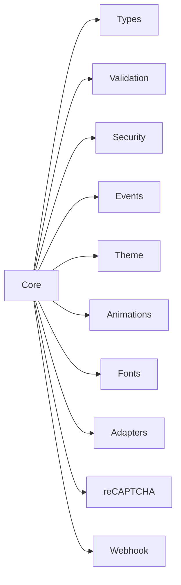
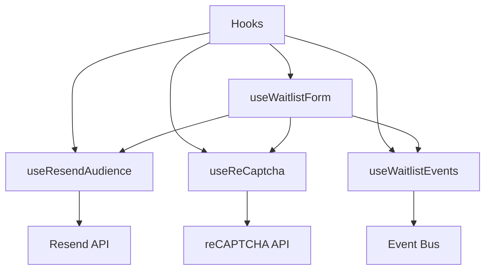
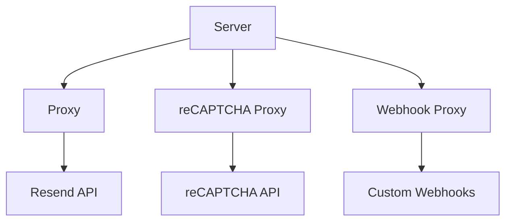
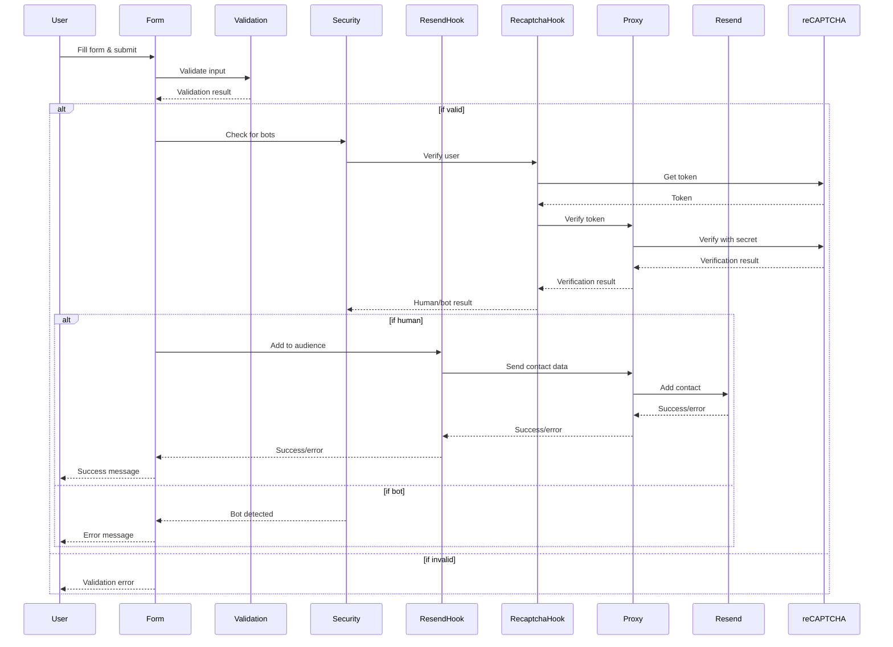
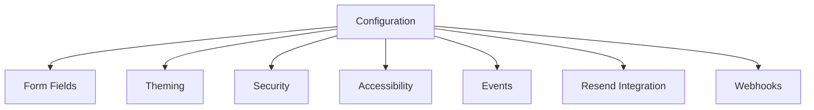
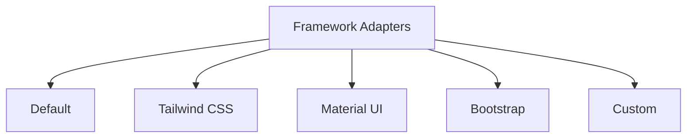
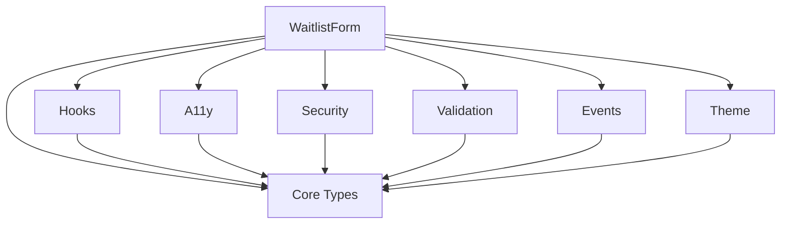

# Architecture

This document provides an in-depth look at the architecture of the React Waitlist component.

## High-Level Overview

React Waitlist is designed with a modular architecture that separates concerns, making it easy to maintain and extend. The main components are:

## Component Structure

### Main Components

The `WaitlistForm` is the main exported component that users interact with. It wraps the `WaitlistFormInner` component with an `AriaProvider` for accessibility support.

## Core Logic

The core logic is organized into the following modules:

- **Types**: TypeScript interfaces and types for the component API
- **Validation**: Form validation logic
- **Security**: Bot protection and security measures
- **Events**: Event handling and custom events
- **Theme**: Theming and styling utilities
- **Animations**: Animation utilities
- **Fonts**: Font loading utilities
- **Adapters**: Framework adapters for different UI libraries
- **reCAPTCHA**: Google reCAPTCHA integration
- **Webhook**: Webhook handling

## Hooks

Custom React hooks provide functionality for different aspects of the component:

- **useResendAudience**: Manages integration with Resend audiences
- **useReCaptcha**: Handles reCAPTCHA verification
- **useWaitlistEvents**: Provides event handling functionality
- **useWaitlistForm**: Combines the above hooks for form handling

## Server-Side Components

The server-side components provide proxy endpoints for secure API access:

- **Proxy**: Proxies requests to the Resend API
- **reCAPTCHA Proxy**: Verifies reCAPTCHA tokens without exposing the secret key
- **Webhook Proxy**: Handles webhook requests

## Data Flow

The following diagram shows the flow of data through the component:

## Configuration Options

The component can be configured with various options:

For detailed configuration options, see the [API Reference](./api.md).

## Framework Integration

React Waitlist provides adapters for various CSS frameworks:

These adapters transform the component's theme configuration to match the target framework's styling conventions.

## Module Dependency

The dependency graph shows how the modules depend on each other:

This modular design allows for easy maintenance and extension of the component. 