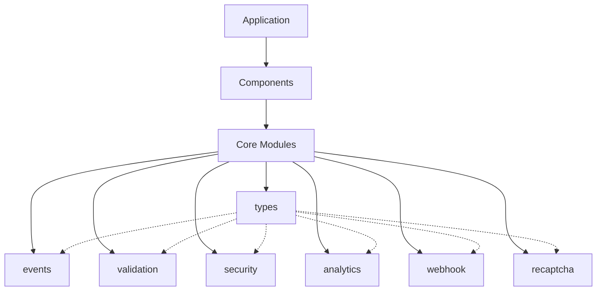
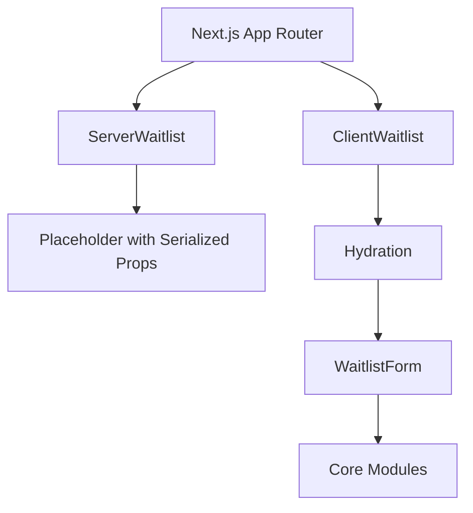
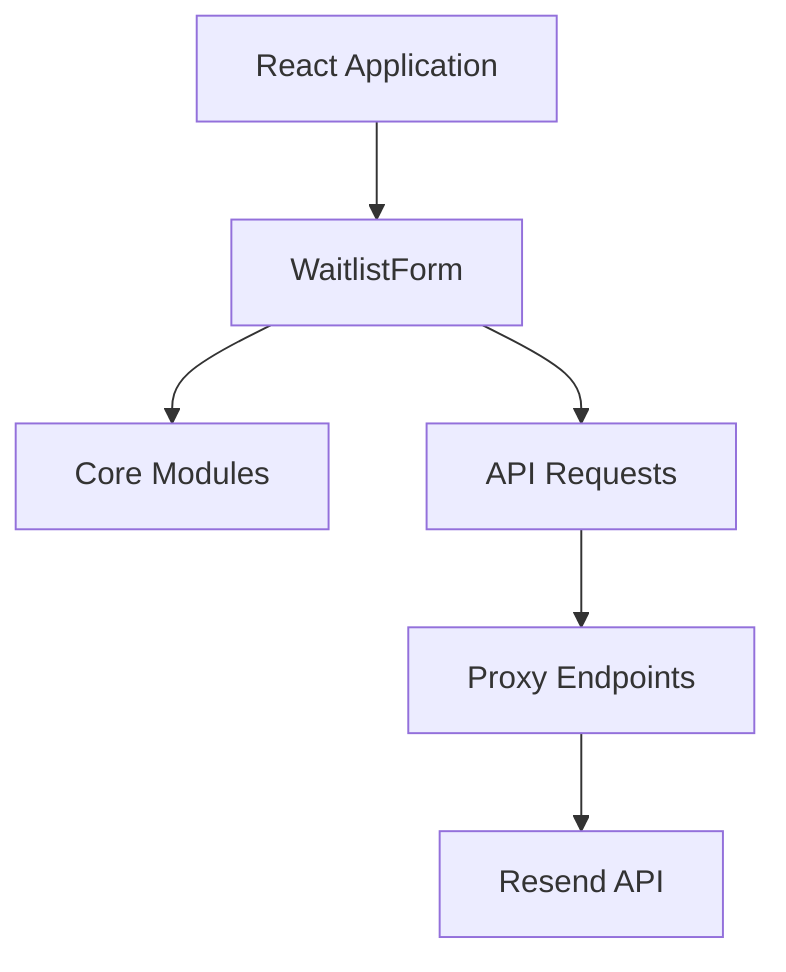
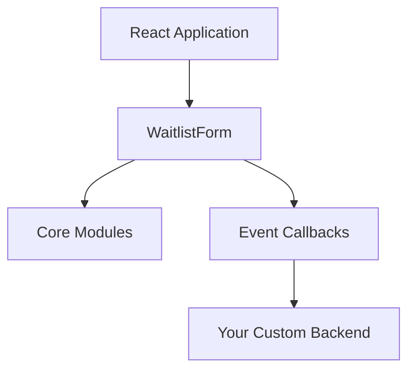
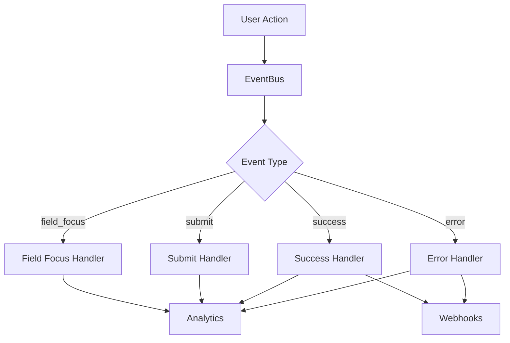

# Architecture

React Waitlist is designed with a modular architecture that separates concerns and promotes maintainability.

## Core Modules Architecture

The library is built around a set of core modules, each with a specific responsibility:



### Core Modules

- **core/types**: Type definitions for the entire library
- **core/events**: Event system for tracking user interactions
- **core/validation**: Form validation logic
- **core/security**: Security features like honeypot fields and bot detection
- **core/analytics**: Analytics tracking integrations
- **core/webhook**: Webhook handling for external integrations
- **core/recaptcha**: reCAPTCHA integration

This modular approach allows for better maintainability, testability, and tree-shaking.

## Component Architecture

The component architecture follows a modular approach with three main integration methods:

### 1. Server-Side Rendering (SSR) Architecture

For frameworks with server-side rendering support (Next.js App Router, Remix, etc.):



This architecture consists of two main components:

1. **ServerWaitlist (Server Component)**: 
   - Runs exclusively on the server
   - Securely handles API keys and sensitive configuration
   - Renders a placeholder with serialized props
   - No React hooks or client-side code
   - Imported from `react-waitlist/server`

2. **ClientWaitlist (Client Component)**:
   - Has the `'use client'` directive
   - Hydrates the placeholder rendered by ServerWaitlist
   - Handles all client-side interactivity
   - Uses React hooks for state management
   - Imported from `react-waitlist/client`

### 2. Client-Side with Security Utilities

For client-side React applications:



### 3. Custom Integration

For applications with existing backend systems:



## Package Structure

The package is organized into several directories:

```
react-waitlist/
├── src/
│   ├── components/       # React components
│   │   ├── WaitlistForm.tsx
│   │   └── ...
│   ├── core/             # Core modules
│   │   ├── types.ts
│   │   ├── events.ts
│   │   ├── validation.ts
│   │   ├── security.ts
│   │   ├── analytics.ts
│   │   ├── webhook.ts
│   │   └── recaptcha.ts
│   ├── hooks/            # React hooks
│   │   ├── useWaitlistForm.ts
│   │   ├── useWaitlistEvents.ts
│   │   └── ...
│   ├── server/           # Server-side components and utilities
│   │   ├── serverComponent.tsx
│   │   ├── proxy.ts
│   │   └── ...
│   ├── styles/           # Styling utilities
│   │   ├── theme.ts
│   │   └── ...
│   └── a11y/             # Accessibility utilities
│       ├── AriaProvider.tsx
│       └── ...
├── client.ts             # Client-side entry point
└── server.ts             # Server-side entry point
```

## Export Structure

The package provides multiple entry points:

1. **react-waitlist**: The main package with the `WaitlistForm` component
   ```jsx
   import { WaitlistForm } from 'react-waitlist';
   ```

2. **react-waitlist/server**: Server-side components and utilities
   ```jsx
   import { ServerWaitlist, createResendProxy } from 'react-waitlist/server';
   ```

3. **react-waitlist/client**: Client-side components for hydration
   ```jsx
   import { ClientWaitlist } from 'react-waitlist/client';
   ```

## Data Flow

### Event System

The event system is a core part of the architecture, allowing for integration with analytics and external systems:



The event system uses a publish-subscribe pattern, allowing components to subscribe to specific events and react accordingly.

## Security Architecture

React Waitlist implements multiple layers of security:

1. **API Key Protection**: Server-side components and proxy endpoints keep API keys secure
2. **Bot Protection**: Honeypot fields, submission timing checks, and reCAPTCHA integration
3. **Data Validation**: Both client and server-side validation of form data
4. **CORS Protection**: Proxy endpoints implement CORS protection
5. **Rate Limiting**: Optional rate limiting on proxy endpoints

## Accessibility Architecture

Accessibility is built into the component architecture:

1. **ARIA Attributes**: Proper ARIA roles, states, and properties
2. **Keyboard Navigation**: Full keyboard support
3. **Screen Reader Support**: Announcements for form state changes
4. **Reduced Motion Support**: Respects user preferences for reduced motion
5. **Focus Management**: Proper focus handling for form submission and errors

## Testing Architecture

The testing architecture follows the modular approach:

1. **Unit Tests**: Test individual modules in isolation
2. **Integration Tests**: Test components working together
3. **End-to-End Tests**: Test the full user flow

Each core module has its own set of unit tests, ensuring that the functionality works as expected. 