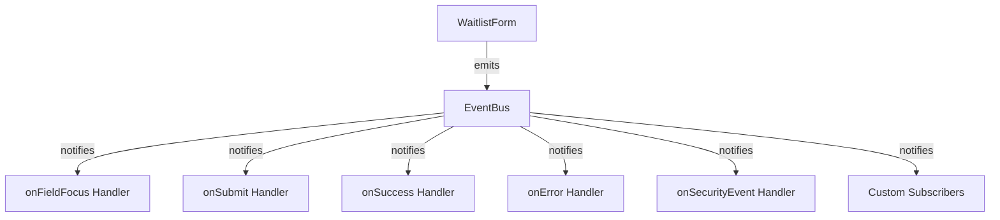

# Events System

The React Waitlist component includes a robust event system that enables seamless integration with analytics, callbacks, webhooks, and other external services.

## Overview

Events are the foundation of React Waitlist's extensibility, allowing you to respond to user interactions, track form submissions, handle errors, and integrate with external services like Resend.

The component emits standardized events that you can use to:

- Track user interactions for analytics
- Execute custom business logic
- Integrate with external services
- Log activity for debugging
- Implement custom validation
- Respond to security concerns

## Event Types

React Waitlist emits the following types of events:

| Event Type | Description | Data Payload |
|------------|-------------|--------------|
| `field_focus` | Triggered when a user focuses on a field | `{ field: string }` |
| `submit` | Triggered when the form is submitted | `{ formData: Record<string, any> }` |
| `success` | Triggered when the submission is successful | `{ formData: Record<string, any>, response: any }` |
| `error` | Triggered when an error occurs | `{ formData: Record<string, any>, error: { message: string, code?: string } }` |
| `security` | Triggered when a security concern is detected | `{ securityType: string, details: Record<string, any> }` |

All events include a `timestamp` field with an ISO-formatted date string.

## Event Handlers in WaitlistForm Props

The WaitlistForm component accepts several event handler props:

```jsx
<WaitlistForm
  // Event handlers
  onFieldFocus={(data) => {
    // Called when a field is focused
    console.log('Field focused:', data.field);
  }}
  
  onSubmit={(data) => {
    // Called when the form is submitted
    console.log('Form submitted:', data.formData);
  }}
  
  onSuccess={async (data) => {
    // Called when submission is successful
    console.log('Submission successful:', data.response);
    
    // You can return a result to override the default success handling
    return { success: true, data: { id: 'custom-id' } };
  }}
  
  onError={(data) => {
    // Called when an error occurs
    console.error('Submission error:', data.error);
  }}
  
  onSecurityEvent={(data) => {
    // Called when a security event occurs
    console.warn('Security event:', data.securityType, data.details);
  }}
/>
```

## The `useWaitlistEvents` Hook

For more advanced use cases, you can use the `useWaitlistEvents` hook to directly interact with the event system:

```jsx
import { useWaitlistEvents } from 'react-waitlist';

function MyComponent() {
  const {
    subscribe,
    subscribeToMany,
    emit,
    emitFieldFocus,
    emitSubmit,
    emitSuccess,
    emitError,
    emitSecurity
  } = useWaitlistEvents();
  
  useEffect(() => {
    // Subscribe to a specific event
    const unsubscribe = subscribe('submit', (data) => {
      console.log('Form submitted:', data.formData);
    });
    
    // Or subscribe to multiple events
    const unsubscribeMany = subscribeToMany(['success', 'error'], (data) => {
      if (data.type === 'success') {
        console.log('Success:', data.response);
      } else {
        console.error('Error:', data.error);
      }
    });
    
    // Clean up subscriptions on unmount
    return () => {
      unsubscribe();
      unsubscribeMany();
    };
  }, [subscribe, subscribeToMany]);
  
  // You can also manually emit events
  const handleCustomAction = () => {
    emitSecurity('custom_check', { passed: true, score: 0.9 });
  };
  
  return <button onClick={handleCustomAction}>Custom Action</button>;
}
```

## Event Data Structure

All events follow a consistent data structure:

```typescript
interface WaitlistEventData {
  /** Type of event */
  type: 'field_focus' | 'submit' | 'success' | 'error' | 'security';
  /** Timestamp of the event */
  timestamp: string;
  /** Field name (for field_focus events) */
  field?: string;
  /** Form data (for submit, success, error events) */
  formData?: Record<string, any>;
  /** Response from API (for success events) */
  response?: any;
  /** Error information (for error events) */
  error?: {
    message: string;
    code?: string;
  };
  /** Security type (for security events) */
  securityType?: string;
  /** Security details (for security events) */
  details?: Record<string, any>;
}
```

## Integration with Analytics

The event system makes it easy to integrate with analytics platforms:

```jsx
<WaitlistForm
  onFieldFocus={(data) => {
    // Google Analytics
    gtag('event', 'field_focus', {
      'event_category': 'waitlist',
      'event_label': data.field
    });
    
    // Mixpanel
    mixpanel.track('Waitlist Field Focus', {
      field: data.field
    });
  }}
  
  onSubmit={(data) => {
    // Google Analytics
    gtag('event', 'submit_waitlist', {
      'event_category': 'waitlist',
      'email': data.formData.email
    });
    
    // Mixpanel
    mixpanel.track('Submit Waitlist', {
      email: data.formData.email
    });
  }}
  
  // ... other event handlers
/>
```

## Integration with Webhooks

Events can be used to trigger webhooks:

```jsx
<WaitlistForm
  onSuccess={async (data) => {
    // Send data to your webhook
    await fetch('https://your-webhook-url.com/waitlist', {
      method: 'POST',
      headers: {
        'Content-Type': 'application/json',
        'Authorization': `Bearer ${YOUR_WEBHOOK_TOKEN}`
      },
      body: JSON.stringify({
        event: 'waitlist_signup',
        data: data.formData,
        timestamp: data.timestamp
      })
    });
    
    return { success: true };
  }}
/>
```

## Security Events

Security events provide information about potential security concerns:

| Security Type | Description | Details |
|---------------|-------------|---------|
| `honeypot_filled` | Honeypot field was filled (likely a bot) | `{ fieldName: string, value: string }` |
| `too_fast` | Form was submitted too quickly (likely a bot) | `{ submissionTime: number, threshold: number }` |
| `recaptcha_failed` | reCAPTCHA verification failed | `{ score: number, action: string }` |
| `recaptcha_error` | Error during reCAPTCHA verification | `{ error: string }` |

Example usage:

```jsx
<WaitlistForm
  onSecurityEvent={(data) => {
    if (data.securityType === 'honeypot_filled' || 
        data.securityType === 'too_fast') {
      // Log bot attempt
      console.warn('Bot detection:', data.securityType, data.details);
      
      // You might want to report this to your security monitoring system
      reportSecurityEvent({
        type: 'bot_attempt',
        details: data.details,
        timestamp: data.timestamp
      });
    }
  }}
/>
```

## Custom Event Handling

You can create custom event handling logic by combining the event system with state management:

```jsx
function MyWaitlistPage() {
  const [submissionCount, setSubmissionCount] = useState(0);
  const [lastSubmission, setLastSubmission] = useState(null);
  
  return (
    <div>
      <WaitlistForm
        onSubmit={(data) => {
          // Increment submission count
          setSubmissionCount(prev => prev + 1);
        }}
        
        onSuccess={(data) => {
          // Store last successful submission
          setLastSubmission({
            email: data.formData.email,
            time: data.timestamp,
            response: data.response
          });
          
          return { success: true };
        }}
      />
      
      {submissionCount > 0 && (
        <div className="stats">
          <p>Form submission attempts: {submissionCount}</p>
        </div>
      )}
      
      {lastSubmission && (
        <div className="last-submission">
          <h3>Last Successful Submission</h3>
          <p>Email: {lastSubmission.email}</p>
          <p>Time: {new Date(lastSubmission.time).toLocaleString()}</p>
        </div>
      )}
    </div>
  );
}
```

## Advanced: Event Bus Architecture

Under the hood, React Waitlist uses a publish-subscribe (pub/sub) event bus pattern:



This architecture allows for:

1. Loose coupling between components
2. Multiple subscribers to the same events
3. Custom event handling outside the main component
4. Extensibility through custom event types

For more information on the implementation patterns, see the [Architecture Documentation](./architecture.md). 